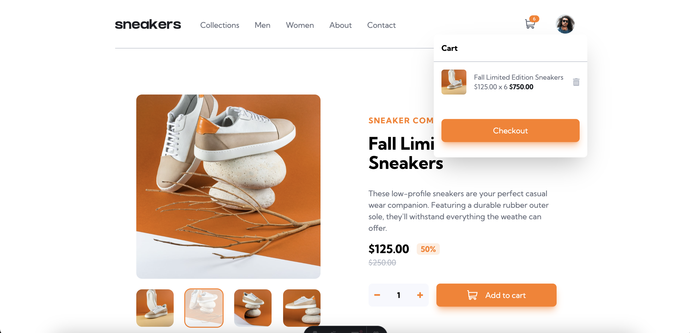

# Frontend Mentor - E-commerce product page solution

This is a solution to the [E-commerce product page challenge on Frontend Mentor](https://www.frontendmentor.io/challenges/ecommerce-product-page-UPsZ9MJp6). Frontend Mentor challenges help you improve your coding skills by building realistic projects.

## Table of contents

- [Overview](#overview)
  - [The challenge](#the-challenge)
  - [Screenshot](#screenshot)
  - [Links](#links)
- [My process](#my-process)
  - [Built with](#built-with)
  - [What I learned](#what-i-learned)
  - [Useful resources](#useful-resources)
- [Author](#author)

## Overview

### The challenge

Users should be able to:

- View the optimal layout for the site depending on their device's screen size
- See hover states for all interactive elements on the page
- Open a lightbox gallery by clicking on the large product image
- Switch the large product image by clicking on the small thumbnail images
- Add items to the cart
- View the cart and remove items from it

### Screenshot

### Links

- Solution URL: [https://github.com/Esosek/product-page](https://github.com/Esosek/product-page)
- Live Site URL: [https://esosek.github.io/product-page](https://esosek.github.io/product-page)

## My process

### Built with

- [React](https://reactjs.org/) - JS library
- [Astro](https://astro.build/) - Web framework
- [Typescript](https://www.typescriptlang.org) - Programming language built on Javascript
- [TailwindCSS](https://tailwindcss.com/) - CSS framework

### What I learned

- React context using Typescript
- Using React with Astro and Tailwind

### Useful resources

- [React Typescript](https://react.dev/learn/typescript) - Helped me learning how to use Typescript with React properly

## Author

- Frontend Mentor - [@Esosek](https://www.frontendmentor.io/profile/Esosek)
